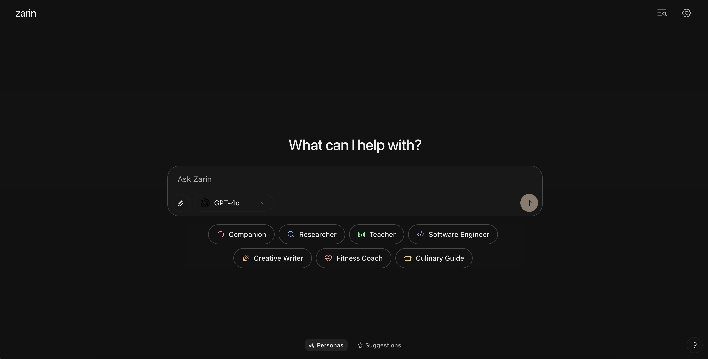

# Zarin

### The first open-source all-in-one AI platform.

Zarin is the first open-source AI platform that provides access to over 200+ popular and latest AI multi-models. 
Now you can literally generate images, videos, audios, codes, write academic papers, cool essays, and more with just one platform. Forget about the hassle of switching between different AI platforms. 

Try [Zarin](https://zarin.vercel.app) now! (it just works).

## ✨ Features

- multi-model support (OpenAI, Grok, Gemini, Claude, DeepSeek, etc.)
- hyper cool UI/UX and themes
- light and dark mode
- prompt suggestions
- file, image uploads
- mobile-friendly layout

## 📦 Installation

See [INSTALLATION.md](./INSTALLATION.md) for setup instructions.

## 🛠️ Built with

- [ai/ml api](https://aimlapi.com) — 200+ AI models integration
- [prompt-kit](https://prompt-kit.com/) — AI components
- [shadcn/ui](https://ui.shadcn.com) — core components
- [motion-primitives](https://motion-primitives.com) — animated components
- [vercel ai sdk](https://vercel.com/blog/introducing-the-vercel-ai-sdk) — model integration, AI features
- [indexdb](https://developer.mozilla.org/en-US/docs/Web/API/IndexedDB_API) — local storage
- [tweakcn](https://tweakcn.com/) - cool themes
- [notlink](https://notl.ink/), [yaps[dot]chat](https://yaps.chat/) - design inspiration

## ⌛️ Coming next

- integrating other 200+ models from [AI/ML API](https://aimlapi.com)
- support for search, crawling, tool calling, agent mode, memory, and etc.
- support for image, video, audio generation, code artifacts all in one platform.
- and of course, more cool and interesting stuff...

## 💙 Contributors

### Interested in Contributing?
Contributions are welcome! Please feel free to submit a Pull Request. Join our [Discord server](https://discord.gg/nUdcd9p8Ae) to get help and support.

# ⭐️ Star History

  <a target="_blank" href="https://star-history.com/#abdibrokhim/zarin&Date">
    <picture>
      <source media="(prefers-color-scheme: dark)" srcset="https://api.star-history.com/svg?repos=abdibrokhim/zarin&type=Date&theme=dark">
      
    </picture>
  </a>

## License

Apache License 2.0

> **Note:** This project is still in development. The codebase is evolving and may change.